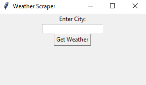

# Weather Scraper GUI 🌤️

A simple Python project to fetch and display the current temperature of any city using web scraping and a graphical user interface (GUI).

<p align="center">

</p>

## 🌟 Features

- Fetch current temperature of any city
- Simple and user-friendly GUI using Tkinter
- Fast and lightweight
- Can be extended to show humidity, wind, and weather condition

---
## Screenshots 📸

 

---

## Requirements ⚡

- Python 3.x
- `requests` library
- `tkinter` (built-in with Python)

Install the required packages using pip:

```bash
pip install requests
```

## 📝 Author

Shahd0sman
